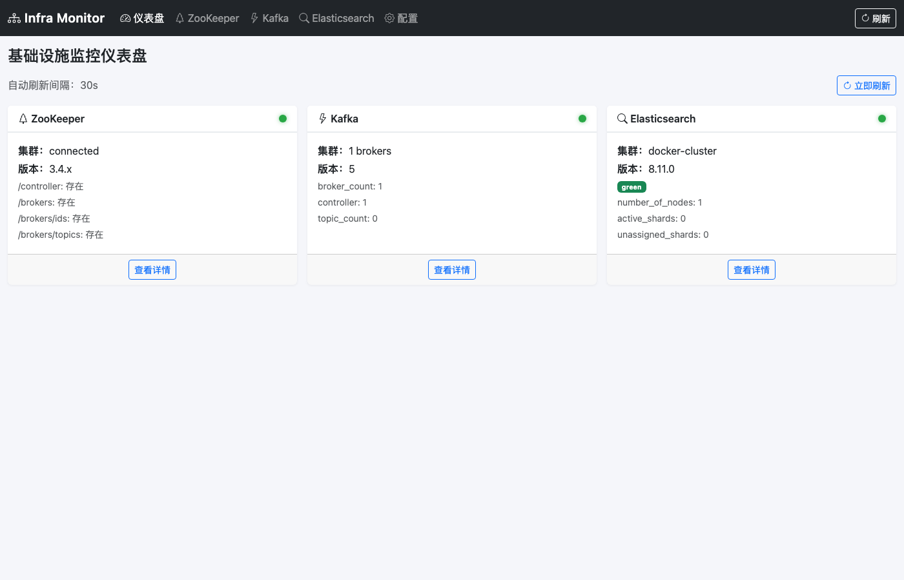
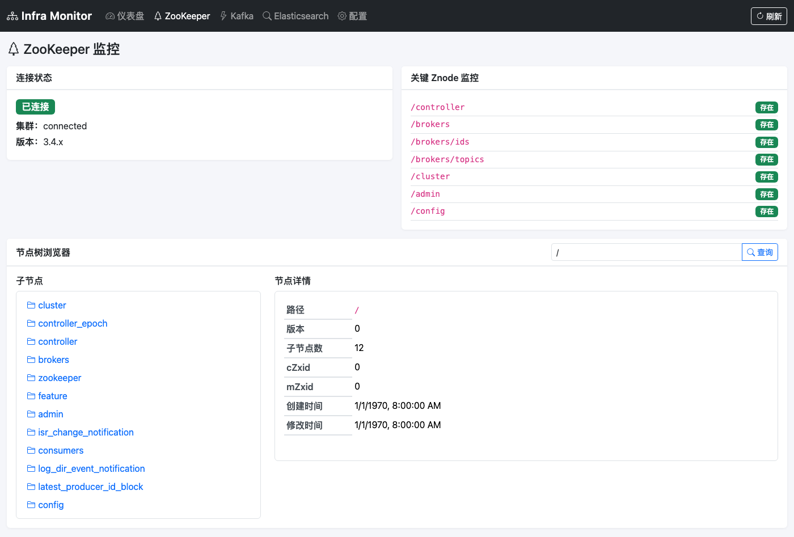

# Infra Monitor

Infra Monitor 是一个轻量级基础设施监控面板，用于在内网或本地环境中快速查看 ZooKeeper、Kafka、Elasticsearch 以及服务器文件的运行状态与基础信息。

## 功能概览

- 首页仪表盘：汇总各组件连接状态、版本和关键指标
- ZooKeeper 监控：集群状态、节点树浏览、节点数据查看
- Kafka 监控：Broker、Topic、Partition、Consumer Group 和消费延迟等基础信息
- Elasticsearch 监控：集群健康、节点负载、索引列表
- 在线文件浏览器：只读浏览服务器文件目录，预览文本、代码和图片文件
- 连接管理：ZooKeeper、Kafka、Elasticsearch 在各自页面内维护连接信息

## Kafka 监控目标

Kafka 模块的长期目标是帮助运维快速判断：集群是否可用、生产者是否还能写入、消费者是否还能读取、数据副本是否安全、消费延迟是否失控、容量和流量是否存在趋势性风险。

后续优化方向包括：

- 使用 Kafka AdminClient 作为主要数据来源，兼容 ZooKeeper 旧集群元数据。
- 展示 broker、topic、partition leader、replicas、ISR、offline partition 和 under-replicated partition。
- 展示 consumer group 状态、成员、订阅 topic、partition 级 offset 和 lag。
- 增加 topic、consumer group、broker 详情页，以及单副本、ISR 不足、lag 高、leader 倾斜等风险提示。
- 预留 JMX Exporter、Prometheus 或兼容指标源入口，用于吞吐、延迟、磁盘和历史趋势监控。

## 技术栈

- Python 3.10+
- FastAPI + Uvicorn
- Jinja2 + Bootstrap 5
- SQLite
- kazoo
- httpx

## 快速开始

推荐使用开发启动脚本，它会启动 Docker 测试环境、同步依赖并运行 FastAPI 应用：

```bash
./start-dev.sh
```

服务启动后访问：

- 直接访问：http://localhost:8000
- Nginx 代理模式：http://yourserver/infra-monitor/

也可以手动启动：

```bash
uv sync
uv run uvicorn app.main:app --host 0.0.0.0 --port 8000 --reload
```

## 文档

项目设计、开发流程和后续规划已整理到 [doc](doc/) 目录：

- [文档索引](doc/README.md)
- [AI Coding 指导原则](AGENTS.md)
- [架构设计](doc/architecture.md)
- [开发流程](doc/development.md)
- [开发计划](doc/development-plan.md)
- [Kafka 监控能力设计](doc/kafka-monitoring-design.md)
- [在线文件浏览器设计方案](doc/file-browser-design.md)

## 截图预览

### 仪表盘



### ZooKeeper 监控



### Kafka 监控


### Elasticsearch 监控


